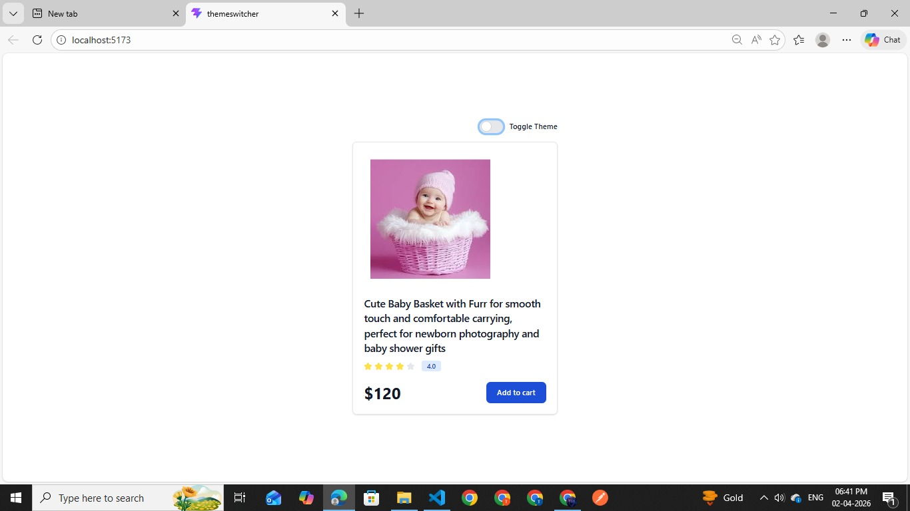

# 🌗 Theme Switcher App

A simple React + Vite project demonstrating dark/light mode using Context API and Tailwind CSS.

---

## ✨ Features

- 🌞 Light / 🌙 Dark mode toggle
- ⚡ Built with React + Vite
- 🎨 Tailwind CSS styling
- 🧠 Context API for global state

---

## 📸 Preview

  
  

---

## 🚀 Tech Stack

- React
- Vite
- Tailwind CSS
- Context API
